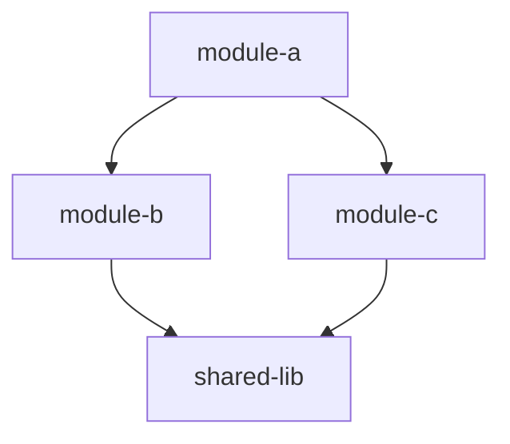
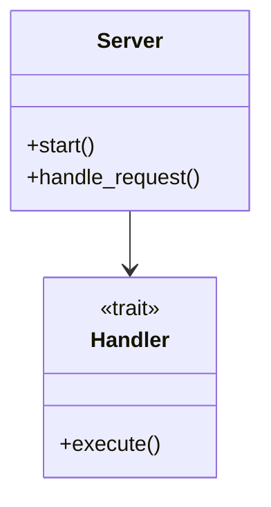
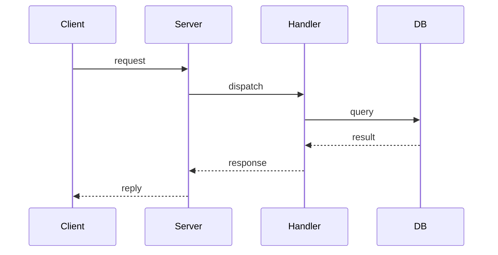
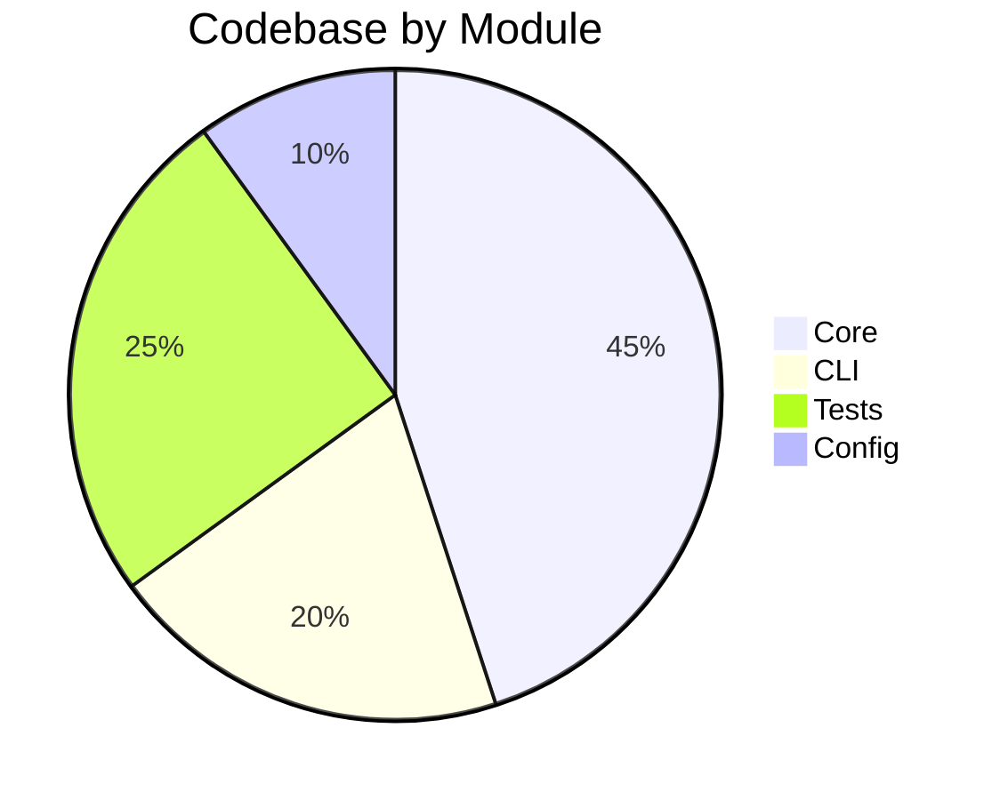

# Map Codebase

Generate a visual architecture overview and write `ARCHITECTURE.md` at the repo root.

## Process

Call the `tools.code_context` verbs in the `runCode` tool to explore the codebase structure, key types, and call graphs. Use Mermaid syntax for diagrams that render on GitHub.

### 1. Check index status

```js
await tools.code_context.getStatus({});
```

If TS or LSP indexing < 90%, wait and re-check — map quality depends on a fully indexed codebase.

### 2. Gather structural data

**File inventory** + scale (use `getStatus` counts):
```js
await tools.code_context.grepCode({ pattern: ".", maxResults: 1 });
```

**Key symbols** — major types, traits, entry points:
```js
await tools.code_context.searchSymbol({ kind: "type", query: "", maxResults: 50 });
await tools.code_context.searchSymbol({ kind: "function", query: "main", maxResults: 10 });
```

**Module structure**:
```js
await tools.code_context.listSymbol({ file: "<entry-point>" });
```

**Call graph** from entry points:
```js
await tools.code_context.getCallgraph({ symbol: "<entry-point>", direction: "outbound", maxDepth: 2 });
```

**Dependencies**:
```js
await tools.code_context.getBlastradius({ file: "<key-file>", maxHops: 2 });
```

Both read the indexed call edges. Where a server has no call hierarchy, such as Python's `pylsp`, those edges come from references instead, thus both still answer — after the index pass. If they answer empty early in a session, wait for `getStatus` to show the index further along, or ask `getInboundCalls` at the entry points, which goes to the server and needs no index.

### 3. Read project config

`Cargo.toml` / `package.json` / `go.mod` / `pyproject.toml`, and entry points (`main.rs`, `lib.rs`, `index.ts`, `main.go`, etc.).

### 4. Write `ARCHITECTURE.md`

Sections (each must include at least one Mermaid diagram where applicable):

**Header**:

```markdown
# Architecture

> Auto-generated by SwissArmyHammer `/map` — [timestamp]

## Overview

[2-3 sentences: what this is, what it does, language/framework]
```

**Module/Package Dependencies** (`graph TD`) — group by layer when there are clear layers (CLI → core → data):

````markdown

````

**Key Types and Relationships** (`classDiagram`) — focus on 10–20 most important types:

````markdown

````

**Key Flows** (`sequenceDiagram`) — 1–3 critical paths (request handling, data pipeline, build):

````markdown

````

**Codebase Composition** (`pie`):

````markdown

````

**Directory Structure** — annotated tree of top-level dirs.

**Symbol Index** — table of major public types/functions grouped by module:

```markdown
| Module | Symbol | Kind | Description |
|--------|--------|------|-------------|
| server | Server | struct | Main server instance |
| server | start | fn | Entry point |
| handler | Handler | trait | Request handler interface |
```

### 5. Summary

```
Wrote ARCHITECTURE.md

- [N] modules/packages mapped
- [N] key types documented
- [N] flows diagrammed
- [N] Mermaid diagrams generated

Diagrams render on GitHub, VS Code, Obsidian.
```

## Rules

- Always write to repo root; overwrite if exists.
- Every section gets at least one Mermaid diagram.
- Diagrams must be valid Mermaid that renders on GitHub.
- Architecture, not implementation — show the forest.
- Back every claim with a query result, not a guess.
- An empty call graph is not a claim. Say which verb gave nothing, and draw the flows from the results that you do have.
- Monorepo/workspace: workspace view first, then drill into key packages.
- **Scoped mapping**: if the user gives a scope — `$ARGUMENTS` — limit the queries and the output to that subdirectory or module.
- Path/module argument → scope the map.
- Keep under 500 lines. Be selective.
